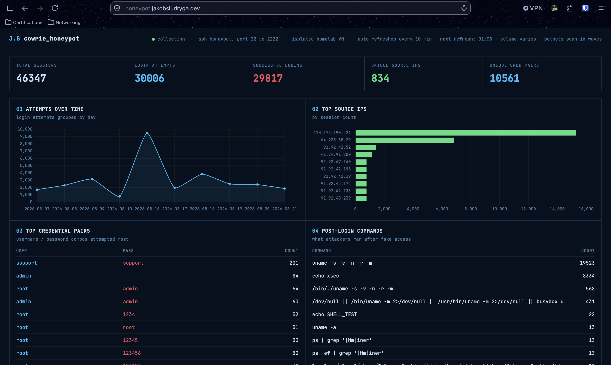
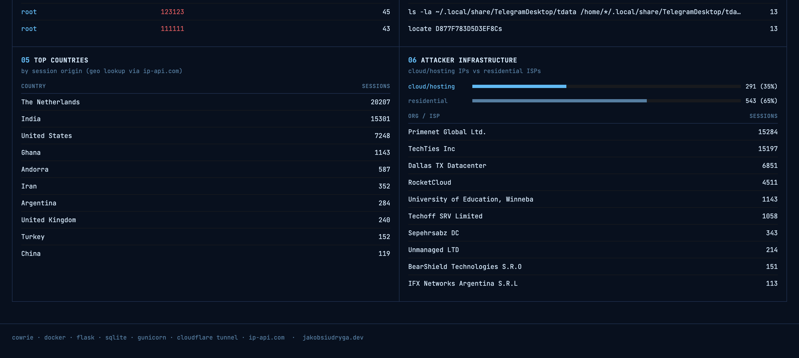
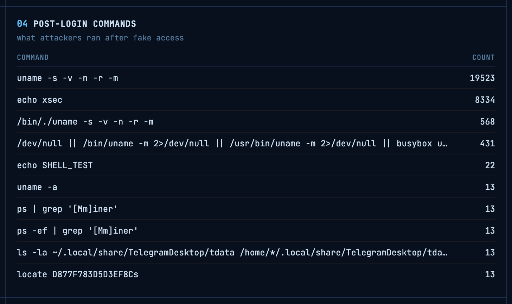

# 🍯 cowrie-honeypot


A medium-interaction SSH honeypot deployed on an isolated Proxmox VM. Capturing and analyzing real-world attack traffic from the public internet, and built to study attacker TTPs (Tactics, Techniques, and Procedures), credential stuffing patterns, and post-entry reconnaissance behavior.

> **Project closed Aug 21, 2026** — data collection ran for exactly 2 weeks (Aug 7–21, 2026). Dashboard remains as a fully accessible live snapshot.

📊 **Dashboard (data collection closed Aug 21, 2026):** [honeypot.jakobsiudryga.dev](https://honeypot.jakobsiudryga.dev)

📄 **Closure Report:** [docs/closure-report.md](docs/closure-report.md)

---

## 📊 Final Data Captured
> Data collection closed: Aug 7 – Aug 21, 2026

| Metric | Count |
|---|---|
| Total Sessions | 46,347 |
| Login Attempts | 30,006 |
| Successful Logins (simulated) | 29,817 |
| Unique Source IPs | 834 |
| Unique Credential Pairs | 10,561 |
| Countries | 10+ |
| Collection Period | 14 days |
| Status | Complete |

---

## 🔧 How It Works

```
Attacker (somewhere on the internet)
↓
Eero Router (port 22 → forwards to port 2222)
↓
Proxmox VM 101 - cowrie container
↓
Cowrie logs sessions to cowrie.json
↓
Cron job (every 9 minutes) → parse_cowrie.py → cowrie.db (SQLite)
↓
Flask dashboard (gunicorn)
↓
CloudFlare Zero Trust Tunnel
↓
honeypot.jakobsiudryga.dev
```

---

## 🖥️ Dashboard Panels

- **01: Attempts Over Time** — login attempts grouped by day
- **02: Top Source IPs** — highest volume attacking IPs by session count
- **03: Top Credential Pairs** — most attempted username/password combos
- **04: Post-Login Commands** — commands attackers ran after receiving fake shell access
- **05: Top Countries** — attack origin by geo location lookup
- **06: Attacker Infrastructure** — cloud/hosting IPs vs residential ISPs




---

## 🔐 Security Design

| Component | Detail |
|---|---|
| VM Isolation | Cowrie VM cannot reach trusted-core (verified by packet loss) |
| Firewall | Default-deny Input Policy · explicit ACCEPT for port 2222 only |
| Zero Trust | Cloudflare Tunnel · no open inbound ports, no exposed origin IP |
| Web Server | Gunicorn (production web server gateway int) · no Flask debug console |
| Least Privilege | Dashboard runs as a non-root user |

---

## 🗺️ MITRE ATT&CK Mapping

| ID | Technique | Tactic | Observed |
|---|---|---|---|
| T1110.001 | Brute Force: Password Guessing | Credential Access | 30,006 attempts using breach credential lists |
| T1078.004 | Valid Accounts: Default Accounts | Initial Access | support/support, admin/admin, root/admin |
| T1082 | System Information Discovery | Discovery | `uname -s -v -n -r -m` — 19,523 executions; automated OS/kernel fingerprinting |
| T1497.001 | Virtualization/Sandbox Evasion | Defense Evasion | `echo xsec` — known honeypot detection string, 8,334 times |
| T1036.003 | Masquerading: Rename Utility | Defense Evasion | `/bin/./uname` path obfuscation to evade string-based detection |
| T1592 | Gather Victim Host Information | Reconnaissance | Systematic OS/kernel/CPU/GPU profiling before payload deployment |
| T1005 | Data from Local System | Collection | Hunting for Telegram session files, SMS-modem hardware, and miner processes |
| T1057 | Process Discovery | Discovery | `ps aux \| grep '[Mm]iner'` — actively scanning for existing cryptomining processes |

---

## 🔍 Key Finding: Automated Reconnaissance Script

The most sophisticated behavior captured was a **multi-stage shell script appearing 431 times**, designed to fully fingerprint the host before deploying any payload:

```bash
uname -s -v -n -r -m; nproc; lscpu | grep -i "model name"; ls /dev/ttyUSB* 2>/dev/null; ls ~/.config/Telegram* 2>/dev/null; echo xsec
```

Beyond this behavior, a significantly more advanced variant was also captured. This one performing deep system enumeration with fallback chains for every command, active shell behavior testing, and GPU detection:

```bash
export PATH=/usr/local/sbin:/usr/local/bin:/usr/sbin:/usr/bin:/sbin:/bin:$PATH
uname=$(uname -s -v -n -m 2>/dev/null || /bin/uname -s -v -n -m 2>/dev/null || busybox uname ...)
arch=$(uname -m 2>/dev/null || ... || echo "")
cpus=$(nproc 2>/dev/null || busybox nproc 2>/dev/null || grep -c "^processor" /proc/cpuinfo)
cpu_model=$(lscpu | awk -F: '/Model name/ {print $2}' ...)
gpu_info=$(lspci | grep -i vga; lspci | grep -i nvidia ...)
# + shell behavior fingerprinting, last login history, honeypot detection
```

**What each stage does:**

| Command | Purpose | MITRE Technique |
|---|---|---|
| `uname -s -v -n -r -m` | OS name, kernel version, hostname, architecture | T1082 |
| `nproc` / `grep -c "^processor"` | CPU core count — evaluating mining viability | T1082 |
| `lscpu \| grep "model name"` | CPU model with fallback chain | T1082 |
| `lspci \| grep -i nvidia` | GPU detection — cryptomining capability check | T1592 |
| `ps \| grep '[Mm]iner'` | Scan for existing mining processes on the host | T1057 |
| `ls /dev/ttyUSB*` | Checks for USB serial devices (SMS modems) | T1592 |
| `ls ~/.local/share/TelegramDesktop/tdata` | Hunts for saved Telegram session credentials | T1005 |
| `locate D877F783D5D3EF8Cs` | Searches for a specific credential artifact by hash | T1005 |
| `echo xsec` / shell behavior test | Known honeypot detection — if environment looks fake, abort | T1497.001 |

> **Why this matters:** Because this is an automated pre-payload reconnaissance answering three specific questions before committing: *Is this a real machine or a trap? Is it powerful enough to mine crypto? Does it already hold credentials worth stealing?* The fallback chains (`|| /bin/uname || busybox uname || grep /proc/cpuinfo`) show the attacker is hardening their script against non-standard environments. Suggesting a well put together script and botnet operation, not some lone attacker thats simply just running scripts.



---

## 🕵️ Key Findings

- **65% residential IPs, 35% cloud/hosting** — showing a mix of compromised home routers and VPS-based botnets
- **Aug 16 spike — 9,000+ attempts in a single day** — consistent with a concentrated botnet wave, most likely TechTies ASN cycling through targets
- **TechTies Inc (Netherlands)** — 15,197 sessions from one ASN, consistent with a Mirai-variant botnet (was one of the first major attacks on the honeypot)
- **Primenet Global Ltd. (India)** — 15,284 sessions, the single largest attacking ASN observed
- **University of Education, Winneba (Ghana)** — 1,143 sessions from an academic network, indicating probably compromised institutional infrastructure
- **`echo xsec` appeared 8,334 times** — attackers actively probing for honeypot environments before deploying payloads
- **`uname` executed 19,523 times** — automated OS fingerprinting at scale across the full session window
- **Credential stuffing confirmed** — top passwords (support/support, admin/admin, root/1234) sourced from known breach databases
- **Active miner hunting** — `ps | grep '[Mm]iner'` suggests attackers probing for existing cryptomining infrastructure to hijack
- **Telegram session + SMS-modem harvesting** — full tdata path enumeration across multiple home directory patterns

---

## ⚠️ Risk Narrative

This honeypot captured attacker behavior consistent with **organized, automated botnet infrastructure**, not just some simple playful scanning. The scale of credential spraying (30,006 attempts across 10,561 unique credential pairs), combined with active honeypot evasion and a multi-layered pre-payload reconnaissance, indicates threat actors operating with a level of sophistication that poses real risk to any exposed SSH service.

The most significant finding: a 431-count fingerprinting script hunting for Telegram sessions, SMS-modem hardware, GPU resources, and existing miner processes. This being a great example of what is actually looked for by these attackers, showing that they are not only seeking computing capabilities for cryptomining, but are also harvesting existing credentials whenever possible and identifying infrastructure they can repurpose. The presence of fallback command chains and active shell behavior testing shows deliberate engineering to evade detection environments. A real-world deployment of the same service, without the honeypot layer, would represent a high-probability path to credential and crypto mining infrastructure loss.

**Recommended controls:** Key-based SSH authentication only (disable password auth), MFA on all remote access, network segmentation that will isolate the internet facing services, and behavioral detection rules aligned to T1082, T1497, and T1057 activity patterns.

---

## 🛠️ Stack

| Component | Detail |
|---|---|
| Honeypot | Cowrie 3.0.12 (Docker) |
| Database | SQLite |
| Parser | Python 3 (custom) |
| Dashboard | Flask + Chart.js |
| Web Server | Gunicorn |
| Geo Enrichment | ip-api.com |
| Public Exposure | Cloudflare Zero Trust Tunnel |
| Monitoring | Uptime Kuma |
| Hypervisor | Proxmox VE 9.2.5 |

---

## 📁 Repo Structure

```
cowrie-honeypot/
├── dashboard/        Flask app + HTML template
├── scripts/          Log parser + geo enrichment
├── config/           Docker setup + cron configuration
└── docs/             Closure report + MITRE mapping + screenshots
```

---

## 📚 What I Learned

- Network segmentation and VM-level firewall architecture
- Real-world attacker TTP analysis mapped to MITRE ATT&CK
- Python log parsing and SQLite database design
- Production web server deployment (Gunicorn vs Flask dev server)
- Zero Trust networking with Cloudflare Tunnel
- Threat actor behavior analysis from raw log data
- Anti-evasion technique identification (T1497.001 in the wild)
- Botnet infrastructure analysis across residential and cloud ASNs
- Incident documentation and structured project closure

---

*Jakob Siudryga · Cybersecurity Student · Sacred Heart University · Part of my homelab project → [github.com/siudrygaj/homelab](https://github.com/siudrygaj/homelab)*
